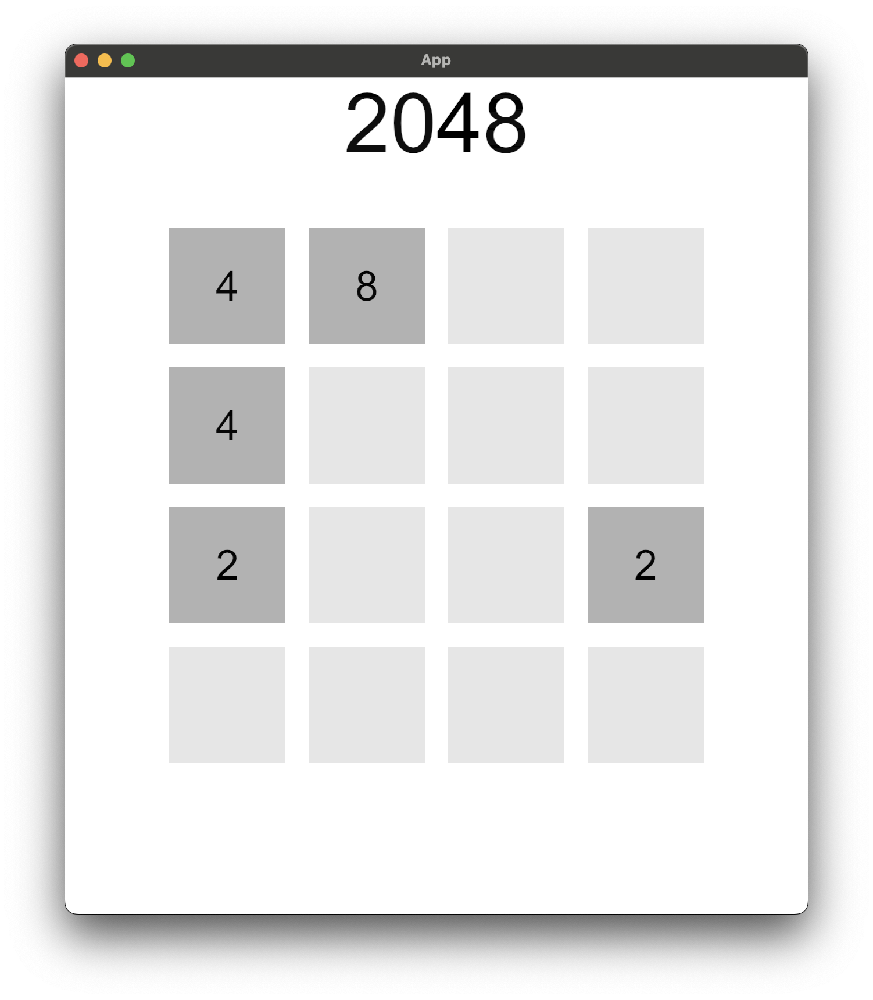

WIP 

just a 2048 clone using rust and bevy with simple animations.

use the arrow keys to play.

there is still a bug that sporadically occurs.

plans:
  - fix the sporadically appearing bug
  - fix coloring issue and introduce new component to control that
  - make animations smoother with easing functions
  - add button press animations
  - add number counting text animation on merge
  - add sound effects for merge, slide
  - add menu and score
  - add new game mechanics

